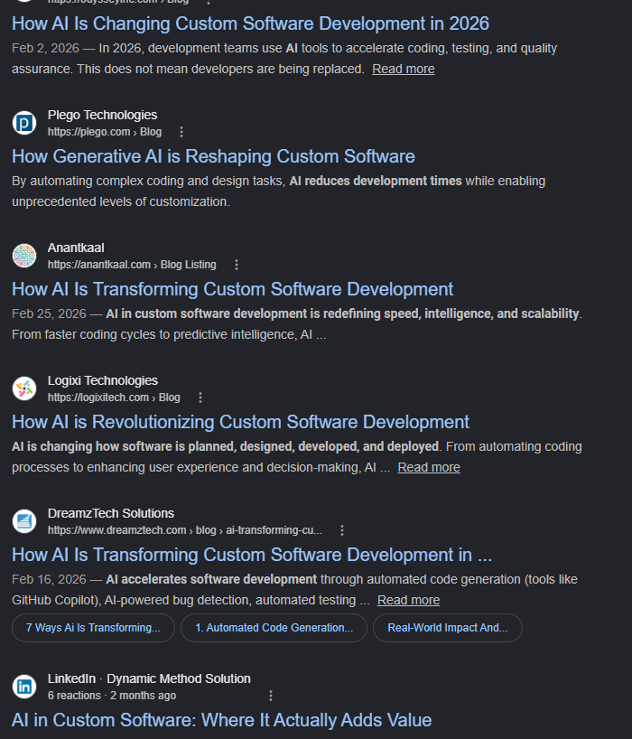

Emdy was a project born of necessity. I needed a simple Markdown web editor that supported Git natively and did not require a login. A sort of hybrid between GitHub/Gists, Notion, and Pastebin. Surprisingly enough, nothing seemed to fit the bill quite to the extent I was hoping for. Now, there's Emdy :)

[https://emdy.dev](https://emdy.dev)

Emdy projects are backed by real Git repos, do not require a login to create/edit/share, and can store other non-Markdown files (and supports custom themes).

## Background

For the past few months, I've been working more and more with LLMs and agents in both coding and personal assistant style tasks. Like many others exploring this space, I had sort of landed on Markdown as being a common ground between myself and these agents. Markdown is great because it is a format that is easy and familiar enough for me to manipulate directly myself and structured and token-efficient enough for LLMs to work with and understand as well.

Recently, I started needing to be able to share some of these research documents being created with Claude with others, but the question was how? Notion and Google Docs both support Markdown, but when I tried to paste in some of these larger Markdown docs I started running into issues around formatting or internal heading links not working correctly. I've heard of Obsidian, but from what I understand that requires a paid tier in order to sync documents across devices. Pastebin works for quick sharing, but is hard to read and can't be edited easily. I could go on, but you get the idea.

## Enter Emdy

We've all been seeing and hearing more about the rise of bespoke, customized software recently. Why settle for terminals, IDEs, frameworks, libraries, or any other piece of software that might have rough edges or that doesn't fit your workflow quite the way you'd like? Frontier models have become great at diving deep into existing codebases and tweaking things or cobbling together entirely new things from existing packages and concepts. Emdy is nothing revolutionary, but it's exactly what *I* was looking for in a workflow, so I built it with the help of Claude Code.



## Coding with Claude

This was the first greenfield project that I've worked on that was pretty much 100% written by Claude with heavy steering from myself. Based on what I've been seeing and reading elsewhere, combined with my own experimentation and trials, I ended up with a system for creating tasks in a backlog and handing them off to Claude Code for work. I worked in a single Claude Code instance at a time and each commit was reviewed by me. I know and understand Emdy in its entirety and can (and have) worked in the codebase myself as well. Emdy is well maintained and readable. Tech debt was scheduled in as needed to ensure the codebase was still usable from a human perspective at all times.

Emdy consists of a TypeScript monorepo using vanilla npm workspaces. The directory and file structure that enables Claude to effectively work in the project is shown below:

* `CLAUDE.md` - Single line file "importing" the main instruction file: `@AGENTS.md`
* `AGENTS.md` - Detailed instructions for Claude: description of related doc files, task development lifecycle details, monorepo details, styling/code preferences, development/testing guidelines, unit/integration/e2e testing guidance, and hard rules (e.g: do not attempt to commit or deploy changes, tests must always pass)
* `README.md` - Standard README doc describing the project
* `docs/TASKS.md` - Checklist style tasks grouped under related sections (frontend, backend, technical debt, admin experience, developer experience, etc.)
* `docs/PLAN.md` - Basically an empty file with a very brief description at the top followed by a separator `---` line. This is the agent's planning workspace and they're expected to clean it up after they're done
* `docs/tasks.duckdb` - Local [DuckDB](https://duckdb.org/) database used to store historical tasks and related metadata (ID, description, status, created date, etc.)
* `docs/BACKEND.md` - High-level overview and callouts of the backend architecture, key decisions that were made, gotchas, etc.
* `docs/FRONTEND.md` - Similar insights but for the frontend application

### Development Lifecycle

The overall development flow went something like this:

1. Add task to the `docs/TASKS.md` file using a checklist format and a medium level of verbosity based on the task: `* [ ] Add relevant icons to buttons`
2. Instructions in the `AGENTS.md` file tell the agent to look for any new tasks that do not have an ID assigned and, if new tasks are found, query the duckdb database for the latest task IDs (using hardcoded queries in the instructions), then increment and assign IDs to new tasks in the order they are found
3. Once all tasks have been properly ID'd, the agent presents 5 tasks for me to choose from for work to begin. At this point, when choosing a task for work, I'll also sometimes provide specific files to the agent for more targeted context when I know it will have to work in certain files. This can help reduce the agent's need to grep for and find certain related files, but is not required
4. Now the agent is planning by searching doc files, code files, and potentially searching the web if integrating a 3rd party package. The agent then captures these details in `PLAN.md` and presents it to me for review. Sometimes we will iterate on a solution a few times before ironing out all the details. Once we've agreed on a plan, the agent then begins implementation
5. Now the agent begins implementing the plan. Over the course of development, I've slowly continued to enable/allow certain tools to run by default but there are plenty of times it runs into things that need permission still. I often have Claude Code open in another monitor window and will check its work periodically and review any tool requests waiting. I'm patient 🙂
6. As part of the `AGENTS.md` instructions, the agent is instructed to write unit, integration, and e2e tests in a standard 3-2-1 testing hierarchy (mostly unit tests, less integration tests, even fewer e2e tests). Sometimes the agent skimps on the integration and e2e tests and I'll need to push it a bit to ensure those are written for things related to API endpoints or front-end changes, but it's pretty good at getting unit tests down
   1. I'm not overly critical of these tests and how strict they're testing things... First off, this is a hobby project. Second, these tests mostly serve to ensure no major regressions, and in that regard, they have done that several times. Specifically the e2e tests have proven extremely valuable, which should not be surprising to most people I would say. Write. E2E. Tests!
7. The agent also has access to a web browser for verifying changes e2e itself in a real browser, when needed. This `browser-tools` SKILL comes from the Pi agent skills git repo: https://github.com/badlogic/pi-skills/blob/main/browser-tools/SKILL.md (modified slightly to run headlessly by default with an option to disable headless). This is just an npm package using puppeteer to control a browser, and Claude manages to navigate it pretty well.
8. Once the agent is satisfied, the last instructions in the `AGENTS.md` tell the agent to clean up after itself: remove the completed task from the TASKS doc, ensure the duckdb ledger status is updated for the task, and clean up the PLAN doc
9. Code is written, tests are written and passing, front-end visible changes tested manually in a real browser, now it's time to...
10. Commit! ***NO.*** We don't ever let the agent commit or deploy any code. All code changes are reviewed, tested manually, then after all that, I commit the changes myself with a brief description including the generated task ID for tracking with the duckdb ledger.

```
Create task -> Assign task ID -> Research and gather context -> Create plan in persistent doc -> Execute plan -> Write tests -> Test in browser (optionally) -> Clean up task and plan
```
<br />

The vast majority of the work done on Emdy was done using Claude Code, specifically Sonnet 4.6 (eventually 4.7/4.8 slightly). For some very simple tasks I dropped to Haiku (text changes, single component changes) and tried to provide more specific context and tasks. For a few larger tasks I did bump up to Opus. Honestly though, the larger model tended to be overly verbose and burn more tokens, whereas I found just using Sonnet and breaking things down into smaller pieces resulted in just-as-good results generally.

One benefit of this development lifecycle is there's sort of natural divide between two heavy-lifting phases here. The first is to create the plan, which requires the agent to read doc files which can be lengthy, grep to find certain files, read those files either entirely or in pieces, read external documentation from packages, read webpages or github issues, etc. all of which burn a good amount of tokens and can clutter the context. Once it has done all this research, we have it write a thorough plan and persist it to a PLAN doc. Now, we can run a compaction here to summarize what we've done so far and we'll have a thorough plan written that we can then pass off to the newly compacted context of the session. This was done quite often for larger tasks and can be repeated for sub-tasks within those larger tasks as needed.

## Ok, so...?

Coding with Claude was fun. It's easy to feel like "What's the point of all this?", with the answer pretty much being "There is no point". To put it simply enough, this was a fun project to learn more about development *with* AI while also building something useful for myself.

None of these concepts, packages, or decisions were novel in and of themselves, but nothing existed (AFAIK) that was quite what I was looking for either. The fact that this wasn't some groundbreaking idea was also what made this project a good fit for AI. I knew, essentially, what I was looking for, and how to build it. Countless packages, docs, blog posts, and issues have been written about the various problems I was working through already. What *was* unknown at the time was implementation details and the code to drive those decisions. Given enough development constraints and structure (git repo, structured Markdown docs, detailed instructions, tight feedback loop), Claude was more than capable of working through those details when they were broken down into bite-sized pieces, and I was always there to steer it back on track in the times that it started to go off the rails.

I'm beginning to work on Emdy with local models running on Unsloth Studio inside a container. I'm hoping these SDLC processes will allow even non-frontier models to have some level of success working in a small-medium sized project with relatively complex but well-defined tasks. We'll see how that goes...

Working with AI can be fun, so build something cool or fun for yourself. And check out [Emdy](https://emdy.dev) if you ever find yourself wanting a simple web-based Markdown editor.